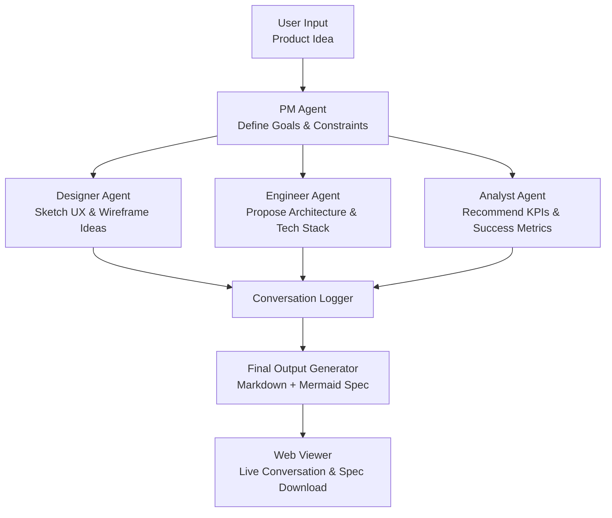

# 🤖 Multi-Agent Product Brainstormer

A multi-agent LLM system that simulates a cross-functional product team (PM, Designer, Engineer, Analyst) to brainstorm product ideas and generate structured MVP specifications.

---

## 🧠 What It Does

Given a product idea (e.g., "AI-powered resume reviewer"), the system does the following:

- **PM Agent** defines goals, constraints, user personas, and MVP scope.
- **Designer Agent** outlines UX flow and key wireframe components.
- **Engineer Agent** proposes architecture and tech stack.
- **Analyst Agent** identifies KPIs, success metrics, and experimentation strategies.
- **Output** is a clean markdown-based MVP spec, including a Mermaid diagram.

---

## 🧩 Architecture



---

## 🛠️ Tech Stack

- Python + Langroid
- React (planned for frontend)
- OpenAI GPT-4 API
- Mermaid.js
- Markdown spec output
- Optional: WebSockets for real-time interaction

---

## 🚀 How to Run

### 1. Backend Setup

```bash
cd backend
pip install -r ../requirements.txt
python main.py
```

### 2. Example Prompt

```bash
AI-powered resume reviewer for job seekers that gives feedback in real time
```

### 3. Output

Generates: `/outputs/brainstorm_output.md`

---

## 📂 Project Structure

```
multi_agent_product_brainstormer/
├── backend/
│   ├── main.py
│   ├── agents/
│   │   ├── pm_agent.py
│   │   ├── designer_agent.py
│   │   ├── engineer_agent.py
│   │   └── analyst_agent.py
├── outputs/
├── diagrams/
│   └── architecture.md
├── prompts/
│   └── base_prompts.txt
├── requirements.txt
└── README.md
```

---

## 📋 Sample Prompts

- "AI travel planner that gives real-time itinerary suggestions"
- "Smart grocery list builder that syncs with family"
- "Remote job matcher for tech freelancers"
- "Language learning app that adapts to user mood"

---

## 📈 Future Improvements

- Add web-based UI for real-time brainstorming
- Extend to allow agent memory and refinement loops
- Embed LLM calls with LangGraph or AutoGen
- Export to HTML/PDF

---

## 📄 License

MIT
