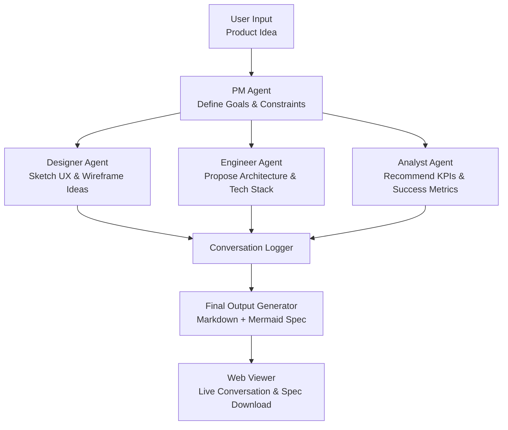

```mermaid
graph TD
    A[User Input<br>Product Idea] --> B[PM Agent<br>Define Goals & Constraints]
    B --> C[Designer Agent<br>Sketch UX & Wireframe Ideas]
    B --> D[Engineer Agent<br>Propose Architecture & Tech Stack]
    B --> E[Analyst Agent<br>Recommend KPIs & Success Metrics]
    C --> F[Conversation Logger]
    D --> F
    E --> F
    F --> G[Final Output Generator<br>Markdown + Mermaid Spec]
    G --> H[Web Viewer<br>Live Conversation & Spec Download]
```
